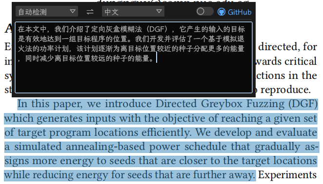

# Copy Translator

Copy Translator 是使用Rust编写的翻译小工具

## 仓库地址

[zu1k/copy-translator: 简单、轻量、好用的划词翻译软件，利用DeepL翻译，无需注册api token (github.com)](https://github.com/zu1k/copy-translator)

## 特点

- 轻量
- 自动去除多余的换行和断句，优化PDF翻译体验
- 选中即翻译(划词翻译)，专注论文阅读
- 使用DeepL进行翻译，翻译效果极佳，无需api token

## 使用说明

工具仅一个exe，启动后会驻留后台，选中文本后按 `ctrl+q` 唤起翻译界面，`esc`关闭界面，`ctrl+shift+d`完全退出

在界面开启的情况下，可以通过选中文本触发翻译行为，无需快捷键，俗称“划词翻译”

## 个人体验

- 简洁：没有花哨的界面，平时不使用时隐藏在后台，不会干扰正常的工作和学习。
- 简便：只需要两个快捷键：`ctrl+q`和`esc`。

## 升级版本
仓库：[Foreign language reading and translation assistant based on copy and translate. ](https://github.com/CopyTranslator/CopyTranslator)
