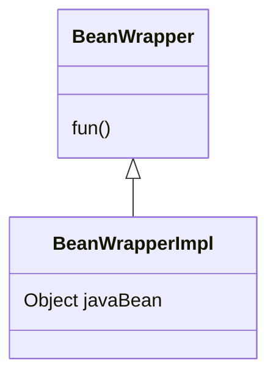

# 1 `BeanWrapper`是什么？

`org.springframework.beans.BeanWrapper`接口是Spring中对*JavaBean*进行操作的基础工具中的核心接口。

> JavaBean指的是一个满足以下要求的类：
>
> 1. 有一个默认的没有参数的构造器。
> 2. 每个成员变量都有符合命名规范的setXxx()和getXxx()方法。

本质上来看，它对*JavaBean*进行了封装，并提供了对内部*JavaBean*进行操作的基本方法。我们可以抽象地理解成如下类图：



通过`BeanWrapper`，我们可以不使用`setter()/getter()`方法，就可以对*JavaBean*中的属性进行操作。

# 2 `BeanWrapper`的基本使用

- `Person`：

```java
public class Person {
    private String name;
    private int age;
    private Address address;
	// 省略setter和getter方法
}
```

- `Address`：

```java
public class Address {
    private String country;
    private String province;
	// 省略setter和getter方法
}
```

`Person`和`Address`都是*JavaBean*。

在不使用`BeanWrapper`的情况下，实例化`Person`对象的正常过程如下：

```java
Address address = new Address();
address.setCountry("中国");
address.setProvince("福建");
Person person = new Person();
person.setName("Xianhuii");
person.setAge(18);
person.setAddress(address);
System.out.println(person);	
```

使用`BeanWrapper`后，可以通过以下方式进行实例化：

```java
Person person = new Person();
BeanWrapper beanWrapper = new BeanWrapperImpl(person);
beanWrapper.setPropertyValue("name", "Xianhuii");
beanWrapper.setPropertyValue("age", 18);
beanWrapper.setPropertyValue("address", new Address());
beanWrapper.setPropertyValue("address.country", "中国");
beanWrapper.setPropertyValue("address.province", "福建");
System.out.println(person);
```

重写toString()方法，上述两种方式的输出都为：

```
Person{name='Xianhuii', age=18, address=Address{country='中国', province='福建'}}
```

`BeanWrapper`也可以直接获取对象的属性值：

```java
Address address = (Address) beanWrapper.getPropertyValue("address");
System.out.println(address);    // Address{country='中国', province='福建'}
```

# 3 

