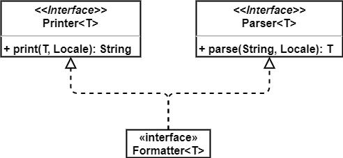
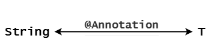
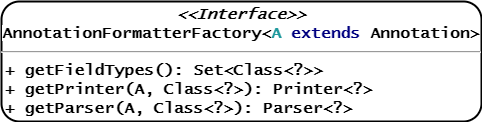

# 1 `Formatter<T>`

`Formatter<T>`是Spring提供用于格式化的*SPI*接口，本质上只是提供在不同地区`T`←→`String`之间相互转换的功能：


它本身没有定义方法，而是继承了`Printer<T>`和`Parser<T>`接口：



因此，`Formatter<T>`拥有了`print()`和`parse()`的功能。

举个简单的例子，如果我们需要实现不同地区`Date`←→`String`之间的相互转换，可以按照以下步骤实现：

1. 实现`Formatter`接口，指定泛型为`Date`。
2. 重写`print()`方法，实现`Date`→`String`。
3. 重写`parse()`方法，实现`String`→`Date`。

```java
public final class DateFormatter implements Formatter<Date> {
    private String pattern;

    public DateFormatter(String pattern) {
        this.pattern = pattern;
    }

    public String print(Date date, Locale locale) {
        if (date == null) {
            return "";
        }
        return getDateFormat(locale).format(date);
    }

    public Date parse(String formatted, Locale locale) throws ParseException {
        if (formatted.length() == 0) {
            return null;
        }
        return getDateFormat(locale).parse(formatted);
    }

    protected DateFormat getDateFormat(Locale locale) {
        DateFormat dateFormat = new SimpleDateFormat(this.pattern, locale);
        dateFormat.setLenient(false);
        return dateFormat;
    }
}
```

测试一下：

```java
DateFormatter dateFormatter = new DateFormatter("yyyy年MM月dd日 HH点mm分");
Date date = dateFormatter.parse("2022年1月21日 20点58分", Locale.CHINESE);
System.out.println(date);   // Fri Jan 21 20:58:00 CST 2022
String str = dateFormatter.print(new Date(), Locale.CHINESE);
System.out.println(str);    // 2022年01月21日 21点00分
```

我们在日常该如何使用`Formatter`：

1. 通过实现类指定的泛型`T`，确定功能：`T`←→`String`。
2. 调用`print()`方法：`T`→`String`。
3. 调用`parse()`方法：`String`→`T`。
4. 具体执行逻辑可以针对性地看看注释/源码。

# 2 `AnnotationFormatterFactory<A extends Annotation>`

顾名思义，`AnnotationFormatterFactory`接口可以实现`Annotation`←→`Formatter`的绑定，从而使用注解即可完成类型的转换：


从而，在Spring MVC将前端Json字符串转成DTO等场景时，可以根据注解进行格式化：



`AnnotationFormatterFactory`接口类图如下：



- `A`：指定绑定的`@Annotation`，例如`@NumberFormat`。
- `getFieldTypes()`：获取`@Annotation`所能标记的所有类型，亦即`Formatter`中的`T`。
- `getPrinter()`：获取格式化该类型的`Printer`：`T`→`String`。
- `getParser()`：获取格式化该类型的`Pareser`：`String`→`T`。

例如，为了实现`@NumberFormat`与`Formatter`的绑定，可以按照如下步骤进行：

1. 实现`AnnotationFormatterFactory`接口，指定泛型为`NumberFormat`。
2. 实现`getFieldTypes()`方法，指定`@NumberFormat`所能标注的所有类型。
3. 实现`getPrinter()`方法，返回对应的`Printer`。
4. 实现`getParser()`方法，返回对应的`Parser`。

```java
public final class NumberFormatAnnotationFormatterFactory
        implements AnnotationFormatterFactory<NumberFormat> {
    public Set<Class<?>> getFieldTypes() {
        return new HashSet<Class<?>>(asList(new Class<?>[]{
                Short.class, Integer.class, Long.class, Float.class,
                Double.class, BigDecimal.class, BigInteger.class}));
    }

    public Printer<Number> getPrinter(NumberFormat annotation, Class<?> fieldType) {
        return configureFormatterFrom(annotation, fieldType);
    }

    public Parser<Number> getParser(NumberFormat annotation, Class<?> fieldType) {
        return configureFormatterFrom(annotation, fieldType);
    }

    private Formatter<Number> configureFormatterFrom(NumberFormat annotation, Class<?>
            fieldType) {
        if (!annotation.pattern().isEmpty()) {
            return new NumberStyleFormatter(annotation.pattern());
        } else {
            NumberFormat.Style style = annotation.style();
            if (style == NumberFormat.Style.PERCENT) {
                return new PercentStyleFormatter();
            } else if (style == NumberFormat.Style.CURRENCY) {
                return new CurrencyStyleFormatter();
            } else {
                return new NumberStyleFormatter();
            }
        }
    }
}
```

# 3 `FormatterRegistry`

在Spring项目中，应该统一管理所有`Formatter`，`FormatterRegistry`