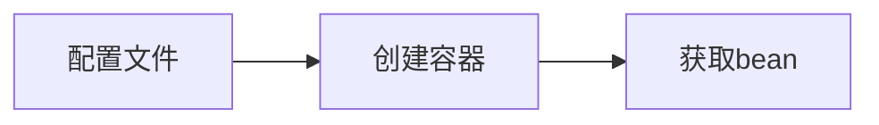
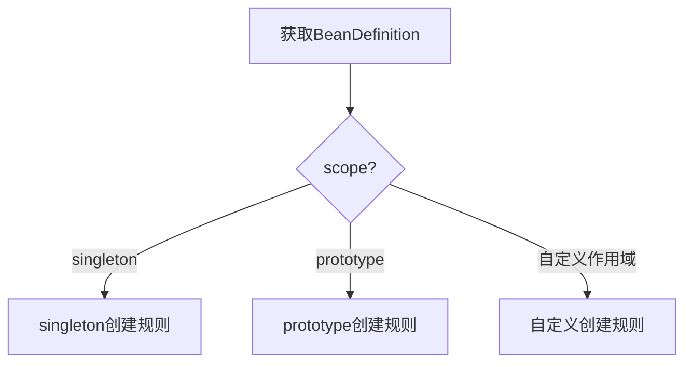
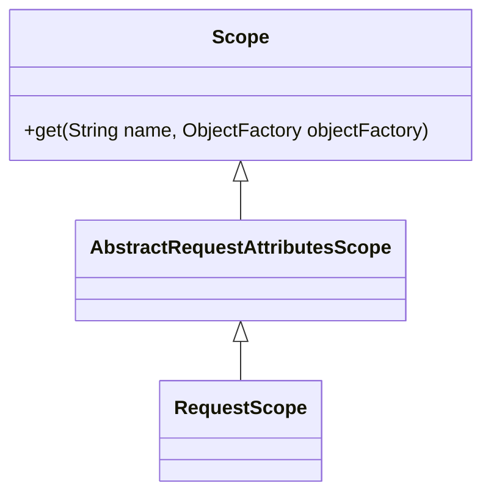

> 本文试图从原理上讲解Spring IoC容器的作用域机制，建议对着源码阅读，事半功倍。

# 0 引入问题

当我们谈到Spring作用域的时候，自然而然会想到如下作用域（来自spring-core官方文档）：

| 作用域      | 描述                                                         |
| ----------- | ------------------------------------------------------------ |
| singleton   | (Default) Scopes a single bean definition to a single object instance for each Spring IoC container. |
| prototype   | Scopes a single bean definition to any number of object instances. |
| request     | Scopes a single bean definition to the lifecycle of a single HTTP request. That is, each HTTP request has its own instance of a bean created off the back of a single bean definition. Only valid in the context of a web-aware Spring ApplicationContext. |
| session     | Scopes a single bean definition to the lifecycle of an HTTP Session. Only valid in the context of a web-aware Spring ApplicationContext. |
| application | Scopes a single bean definition to the lifecycle of a ServletContext. Only valid in the context of a web-aware Spring ApplicationContext. |
| websocket   | Scopes a single bean definition to the lifecycle of a WebSocket. Only valid in the context of a web-aware Spring ApplicationContext. |

从功能上看，这些作用域分别定义了调用`org.springframework.beans.factory.BeanFactory#getBean()`方法时，容器根据`bean definition`实例化`bean object`的规则。

从底层实现上看，这些作用域可以分成两类：

1. 内置作用域：`singleton`和`prototype`。
2. 自定义作用域：`request`、`session`、`application`、`websocket`以及我们自定义的作用域。

所有Spring IoC容器中都具备`singleton`和`prototype`作用域功能，而只有实现Web功能的容器（如`org.springframework.web.context.support.GenericWebApplicationContext`接口）中才具备`request`和`session`等作用域功能。这是因为它们底层的实现机制不同。

spring-core官方文档中说了这么一段话：


我个人这么理解作用域机制的扩展性：

1. 内置的`singleton`和`prototype`作用域——不可扩展。
2. 可以复写`request`和`session`等预定义作用域的规则——可扩展。
3. 可以自定义作用域——可扩展。

以上简要概括了Spring IoC容器作用域的基本概念，希望能够引起大家思考以下几个问题（本文后续部分会一一探讨）：

1. 什么是作用域？如何使用作用域？
2. 作用域的底层原理？
3. 内置作用域和自定义作用域的区别？
4. 如何自定义作用域？

# 1 什么是作用域？如何使用作用域？

## 1.1 什么是作用域？

作用域是个很宽泛的概念，本文讨论的特指是Spring IoC容器中`Bean`对象的作用域，简单可以理解成：`bean`对象的存活范围。

为了便于深入理解，我们先要大概了解一下Spring IoC容器的工作原理。Spring IoC容器的使用流程大概可以分为以下3个步骤：



1. 配置`Bean`：

   ```Java
   @Configuration
   public class AppConfiguration {
       @Bean
       public A a() {
           return new A();
       }
   }
   
   class A {
   
   }
   ```

2. 创建Spring IoC容器，并读取配置信息：

   ```Java
   ApplicationContext context = new AnnotationConfigApplicationContext(AppConfiguration.class);
   ```

3. 从容器中获取`bean`，并使用：

   ```Java
   A a = context.getBean("a", A.class);
   System.out.println(a);	// com.xianhuii.spring.beanscopes.demo01.A@16267862
   a = context.getBean("a", A.class);
   System.out.println(a);	// com.xianhuii.spring.beanscopes.demo01.A@16267862
   ```

**`Bean`作用域本质上指的是多次调用`context.getBean()`方法获取到的是否是同一个`bean`对象。**

上面例子中，默认指定作用域为`singleton`，所以两次调用`context.getBean()`方法获取到同一个对象。

如果指定作用域为`prototype`：

```Java
@Bean
@Scope("prototype")
public A a() {
    return new A();
}
```

此时，两次调用`context.getBean()`方法获取到就是两个对象了：

```Java
A a = context.getBean("a", A.class);
System.out.println(a);	// com.xianhuii.spring.beanscopes.demo01.A@49070868
a = context.getBean("a", A.class);
System.out.println(a);	// com.xianhuii.spring.beanscopes.demo01.A@6385cb26
```

## 1.2 如何使用作用域？

作用域的使用比较简单，只需要在配置`Bean`时使用指定作用域即可。我们使用作用域的重点其实在于不同作用域下`context.getBean()`的规则。

### 1.2.1 `singleton`

`singleton`作用域下，多次调用`context.getBean()`方法获取到同一个对象。

- 配置：

```java
@Configuration
public class AppConfiguration {
    @Bean
    public A a() {
        return new A();
    }
}

class A {}
```

- 使用：

```java
ApplicationContext context = new AnnotationConfigApplicationContext(AppConfiguration.class);
A a = context.getBean("a", A.class);
System.out.println(a);	// com.xianhuii.spring.beanscopes.demo01.A@16267862
a = context.getBean("a", A.class);
System.out.println(a);	// com.xianhuii.spring.beanscopes.demo01.A@16267862
```

### 1.2.2 `prototype`

`prototype`作用域下，每次调用`context.getBean()`方法获取到新对象。

- 配置：

```java
@Configuration
public class AppConfiguration {
    @Bean
    @Scope("prototype")
    public A a() {
        return new A();
    }
}

class A {}
```

- 使用：

```java
ApplicationContext context = new AnnotationConfigApplicationContext(AppConfiguration.class);
A a = context.getBean("a", A.class);
System.out.println(a);	// com.xianhuii.spring.beanscopes.demo01.A@49070868
a = context.getBean("a", A.class);
System.out.println(a);	// com.xianhuii.spring.beanscopes.demo01.A@6385cb26
```

# 2 作用域的底层原理？

**`Bean`作用域本质上指的是多次调用`context.getBean()`方法获取到的是否是同一个`bean`对象。**

所以，作用域底层执行原理在`context.getBean()`方法中，其中与作用域有关的执行流程如下：



1. 从`BeanFactory`中获取已加载的`BeanDefinition`，判断该`Bean`的作用域。
2. 如果是`singleton`作用域，则执行单例创建规则。
3. 如果是`prototype`作用域，则执行原型创建规则。
4. 如果是自定义作用域，则执行自定义创建规则。

相关核心源码如下（`org.springframework.beans.factory.support.AbstractBeanFactory#doGetBean()`）：

```Java
// 获取BeanDefinition
RootBeanDefinition mbd = getMergedLocalBeanDefinition(beanName);

// 1、如果作用域是singleton，执行对应创建规则：创建bean，并放到容器中
if (mbd.isSingleton()) {
    sharedInstance = getSingleton(beanName, () -> {
        try {
            return createBean(beanName, mbd, args);
        }
        catch (BeansException ex) {
            destroySingleton(beanName);
            throw ex;
        }
    });
    beanInstance = getObjectForBeanInstance(sharedInstance, name, beanName, mbd);
}
// 2、如果作用域是prototype，执行对应创建规则：创建bean，但不会放到容器中
else if (mbd.isPrototype()) {
    Object prototypeInstance = null;
    try {
        beforePrototypeCreation(beanName);
        prototypeInstance = createBean(beanName, mbd, args);
    }
    finally {
        afterPrototypeCreation(beanName);
    }
    beanInstance = getObjectForBeanInstance(prototypeInstance, name, beanName, mbd);
}
// 3、如果是自定义作用域，执行对应创建规则：自定义规则
else {
    String scopeName = mbd.getScope();
    Scope scope = this.scopes.get(scopeName);
    try {
        Object scopedInstance = scope.get(beanName, () -> {
            beforePrototypeCreation(beanName);
            try {
                return createBean(beanName, mbd, args);
            }
            finally {
                afterPrototypeCreation(beanName);
            }
        });
        beanInstance = getObjectForBeanInstance(scopedInstance, name, beanName, mbd);
    }
    catch (IllegalStateException ex) {
        throw new ScopeNotActiveException(beanName, scopeName, ex);
    }
}
```

## 2.1 `singleton`作用域

`singleton`作用域`bean`对象的创建过程分为三个步骤：

1. 判断是否为`singleton`作用域。
2. 根据`singleton`规则创建`bean`对象。
3. 对`bean`对象进行后处理。

### 1、判断

`mbd.isSingleton()`方法（`org.springframework.beans.factory.support.AbstractBeanDefinition#isSingleton`）的源码如下：

```Java
public boolean isSingleton() {
   return SCOPE_SINGLETON.equals(this.scope) || SCOPE_DEFAULT.equals(this.scope);
}
```

其中两个静态变量分别为：

```Java
String SCOPE_SINGLETON = ConfigurableBeanFactory.SCOPE_SINGLETON;	// "singleton"
public static final String SCOPE_DEFAULT = "";
```

所以，我们在声明`Bean`时，以下情况会声明为`singleton`作用域：

1. 默认情况（即不显示指定作用域），会默认声明为`SCOPE_DEFAULT`作用域，而`SCOPE_DEFAULT`实际上就是`singleton`作用域。

   ```java
   @Bean
   public A a() {
       return new A();
   }
   ```

2. 显示指定为`singleton`作用域，通过`@Scope("singleton")`等方式。

   ```java
   @Bean
   @Scope("singleton")
   public A a() {
       return new A();
   }
   ```

3. 显示指定为默认作用域，通过`@Scope`等方式。

   ```java
   @Bean
   @Scope
   public A a() {
       return new A();
   }
   ```

### 2、创建单例`bean`

创建单例`bean`的源码如下：

```java
sharedInstance = getSingleton(beanName, () -> {
   try {
      // 创建bean
      return createBean(beanName, mbd, args);
   }
   catch (BeansException ex) {
      // 创建失败，删除缓存
      destroySingleton(beanName);
      throw ex;
   }
});
```

其核心在于`org.springframework.beans.factory.support.DefaultSingletonBeanRegistry#getSingleton(java.lang.String, org.springframework.beans.factory.ObjectFactory<?>)`方法，其中定义了大部分创建单例`bean`的规则（模板方法模式）：

1. 为`singletonObjects`对象（单例对象缓存）加锁：一次只能创建一个单例对象。
2. 从`singletonObjects`中获取当前`beanName`的对象。
3. 如果存在，说明已经创建，直接返回。
4. 如果不存在，说明还没有创建，则进行创建对象：
   1. 预处理。
   2. 创建对象。
   3. 后处理。
   4. 添加到singletonObjects缓存。

```java
public Object getSingleton(String beanName, ObjectFactory<?> singletonFactory) {
   // 1、singletonObjects缓存加锁
   synchronized (this.singletonObjects) {
      // 2、从singletonObjects缓存中获取singletonObject
      Object singletonObject = this.singletonObjects.get(beanName);
      // 3、如果不存在，则创建新对象
      if (singletonObject == null) {
         // 3.1、预处理
         beforeSingletonCreation(beanName);
         boolean newSingleton = false;
         try {
            // 3.2、创建对象
            singletonObject = singletonFactory.getObject();
            newSingleton = true;
         }
         catch (IllegalStateException ex) {
         }
         catch (BeanCreationException ex) {
         }
         finally {
            if (recordSuppressedExceptions) {
               this.suppressedExceptions = null;
            }
            // 3.3、后处理
            afterSingletonCreation(beanName);
         }
         if (newSingleton) {
            // 3.4、添加到singletonObjects缓存
            addSingleton(beanName, singletonObject);
         }
      }
      // 4、如果存在，直接返回
      return singletonObject;
   }
}
```

其中，预处理和后处理都是单例对象创建过程中的回调，可以通过重写自定义回调规则。默认情况下，预处理和后处理会分别标记/清除单例对象“创建中”的标记。

`addSingleton(beanName, singletonObject)`方法会将该对象添加到`singletonObjects`单例对象缓存和`registeredSingletons`已注册单例对象缓存中，并将该对象从`singletonFactories`单例工厂缓存和`earlySingletonObjects`早期单例对象缓存中移除：

```java
protected void addSingleton(String beanName, Object singletonObject) {
   synchronized (this.singletonObjects) {
      this.singletonObjects.put(beanName, singletonObject);
      this.singletonFactories.remove(beanName);
      this.earlySingletonObjects.remove(beanName);
      this.registeredSingletons.add(beanName);
   }
}
```

最重要的`singletonFactory.getObject()`方法是外部传入的，即调用该方法实际上会执行外部传入的匿名对象中定义的方法：

1. 调用`createBean(beanName, mbd, args)`会使用反射机制创建`bean`对象。
2. 如果创建失败，则调用`destroySingleton(beanName)`方法删除相关缓存信息。

```java
try {
   return createBean(beanName, mbd, args);
}
catch (BeansException ex) {
   // Explicitly remove instance from singleton cache: It might have been put there
   // eagerly by the creation process, to allow for circular reference resolution.
   // Also remove any beans that received a temporary reference to the bean.
   destroySingleton(beanName);
   throw ex;
}
```

### 3、后处理

`org.springframework.beans.factory.support.AbstractBeanFactory#getObjectForBeanInstance`方法会对上述根据`BeanDefinition`创建处理`bean`进行后处理，该方法其实就是Spring AOP功能的入口。其内部会进行如下判断：

1. 容器内部使用。
2. 是否为普通`bean`：直接返回。
3. 是否为`org.springframework.beans.factory.FactoryBean`实现类：Spring AOP核心类。

```java
protected Object getObjectForBeanInstance(
      Object beanInstance, String name, String beanName, @Nullable RootBeanDefinition mbd) {

   // 1、pring容器内部bean，不必太过关注
   if (BeanFactoryUtils.isFactoryDereference(name)) {}

   // 2、普通bean，直接返回
   if (!(beanInstance instanceof FactoryBean)) {
      return beanInstance;
   }

   // 3、FactoryBean对象，通过AOP功能获取其真正代理的对象
   Object object = null;
   if (mbd != null) {
      mbd.isFactoryBean = true;
   } else {
      object = getCachedObjectForFactoryBean(beanName);
   }
   if (object == null) {
      // Return bean instance from factory.
      FactoryBean<?> factory = (FactoryBean<?>) beanInstance;
      // Caches object obtained from FactoryBean if it is a singleton.
      if (mbd == null && containsBeanDefinition(beanName)) {
         mbd = getMergedLocalBeanDefinition(beanName);
      }
      boolean synthetic = (mbd != null && mbd.isSynthetic());
      object = getObjectFromFactoryBean(factory, beanName, !synthetic);
   }
   return object;
}
```

## 2.2 `prototype`作用域

`prototype`作用域`bean`对象的创建过程分为三个步骤：

1. 判断是否为`prototype`作用域。
2. 根据`prototype`规则创建`bean`对象。
3. 对`prototype`对象进行后处理。

### 1、判断

`mbd.isPrototype()`方法（`org.springframework.beans.factory.support.AbstractBeanDefinition#isPrototype`）的源码如下：

```java
public boolean isPrototype() {
   return SCOPE_PROTOTYPE.equals(this.scope);
}
```

其中静态变量为：

```Java
String SCOPE_PROTOTYPE = ConfigurableBeanFactory.SCOPE_PROTOTYPE;	// "prototype"
```

所以，我们在声明`Bean`时，可以通过`@Scope("prototype")`等方式显示指定为`prototype`作用域：

```java
@Bean
@Scope("prototype")
public A a() {
    return new A();
}
```

### 2、创建原型`bean`

有了以上经验，我们就能很容易理解创建原型`bean`的源码：

```java
Object prototypeInstance = null;
try {
   // 1、预处理，默认标记为“创建中”状态
   beforePrototypeCreation(beanName);
   // 2、通过反射机制创建对象
   prototypeInstance = createBean(beanName, mbd, args);
}
finally {
   // 3、后处理，默认移除“创建中”标记
   afterPrototypeCreation(beanName);
}
```

### 3、后处理

该后处理过程与`singleton`作用域完全相同。

## 2.3 自定义作用域

如果`BeanDefinition`既不是`singleton`，也不是`prototype`，那么就会执行自定义作用域的创建规则：

1. 获取`BeanDefinition`的`scope`属性值。
2. 从`BeanFactory`的作用域缓存`scopes`中获取对应的作用域。
3. 调用`scope.get()`方法，执行自定义创建规则。
4. 后处理：Spring AOP功能入口，与`singleton`和`prototype`相同。

```java
// 1、获取BeanDefinition的scope属性值
String scopeName = mbd.getScope();
// 2、从BeanFactory的作用域缓存scopes中获取对应的作用域
Scope scope = this.scopes.get(scopeName);
try {
   // 3、执行自定义创建规则
   Object scopedInstance = scope.get(beanName, () -> {
      beforePrototypeCreation(beanName);
      try {
         return createBean(beanName, mbd, args);
      }
      finally {
         afterPrototypeCreation(beanName);
      }
   });
   // 4、后处理
   beanInstance = getObjectForBeanInstance(scopedInstance, name, beanName, mbd);
}
catch (IllegalStateException ex) {
   throw new ScopeNotActiveException(beanName, scopeName, ex);
}
```

从以上源码中我们可以得出自定义作用域的三个步骤：

1. 创建作用域实现类：实现`org.springframework.beans.factory.config.Scope`接口，实现其`get()`方法。

   ```mermaid
   classDiagram
       class Scope
       Scope : +get(String name, ObjectFactory<?> objectFactory)
   ```

2. 将作用域实现类注册到`BeanFactory`的`scopes`缓存中：key为作用域名，value为自定义作用域对象（`org.springframework.beans.factory.config.ConfigurableBeanFactory#registerScope`）。

3. 配置`Bean`时，指定对应的作用域名。

# 3 内置作用域和自定义作用域的区别？

通过上述的讲解，想必大家对内置作用域（`singleton`和`prototype`）和自定义作用域的区别有了本质上的理解。

内置作用域的作用域名和`bean`创建规则已经写死到Spring IoC容器中。

自定义作用域通过自定义的作用域名从`BeanFactory`的`scopes`缓存中找到自定义作用域实现类，根据其中实现的`get()`方法创建`bean`。同时，自定义作用域的`bean`对象存放于自定义的缓存中。

# 4 自定义作用域案例：`request`

接下来，我们以`request`作用域为例，展示如何自定义作用域。

## 4.1 `RequestScope`实现类

该实现类全限定类名为`org.springframework.web.context.request.RequestScope`。类图如下：



其中，最核心的的部分在于`org.springframework.web.context.request.AbstractRequestAttributesScope#get`：

1. 获取当前请求的`RequestAttributes`对象。
2. 从缓存中获取`bean`。
3. 如果缓存中不存在，则需要重新创建：
   1. 使用`objectFactory`匿名对象创建`bean`。
   2. 将`bean`放到缓存中。
   3. 重新从缓存中获取。
4. 如果缓存中存在，直接返回。

```java
@Override
public Object get(String name, ObjectFactory<?> objectFactory) {
   // 1、获取当前请求的RequestAttributes缓存对象。
   RequestAttributes attributes = RequestContextHolder.currentRequestAttributes();
   // 2、从缓存中获取bean
   Object scopedObject = attributes.getAttribute(name, getScope());
   // 3、如果缓存中不存在，则需要重新创建
   if (scopedObject == null) {
      // 3.1、使用objectFactory匿名对象创建bean
      scopedObject = objectFactory.getObject();
      // 3.2、将bean存放到缓存中
      attributes.setAttribute(name, scopedObject, getScope());
      // 3.3、重新从缓存中获取
      // Retrieve object again, registering it for implicit session attribute updates.
      // As a bonus, we also allow for potential decoration at the getAttribute level.
      Object retrievedObject = attributes.getAttribute(name, getScope());
      if (retrievedObject != null) {
         // Only proceed with retrieved object if still present (the expected case).
         // If it disappeared concurrently, we return our locally created instance.
         scopedObject = retrievedObject;
      }
   }
   // 4、如果缓存中存在，直接返回
   return scopedObject;
}
```

## 4.2 注册作用域

在实现Web功能的容器（如`org.springframework.web.context.support.GenericWebApplicationContext`接口）中，会自动将`request`等自定义作用域注册到`BeanFactory`的`scopes`缓存中：

```java
protected void postProcessBeanFactory(ConfigurableListableBeanFactory beanFactory) {
   if (this.servletContext != null) {
      beanFactory.addBeanPostProcessor(new ServletContextAwareProcessor(this.servletContext));
      beanFactory.ignoreDependencyInterface(ServletContextAware.class);
   }
   WebApplicationContextUtils.registerWebApplicationScopes(beanFactory, this.servletContext);
   WebApplicationContextUtils.registerEnvironmentBeans(beanFactory, this.servletContext);
}
```

在这里会调用封装好的`WebApplicationContextUtils.registerWebApplicationScopes(beanFactory, this.servletContext);`方法进行注册：

```java
public static void registerWebApplicationScopes(ConfigurableListableBeanFactory beanFactory,
      @Nullable ServletContext sc) {

   // 1、注册request作用域：key为request，value为RequestScope实现类
   beanFactory.registerScope(WebApplicationContext.SCOPE_REQUEST, new RequestScope());
   // 2、注册session作用域：key为session，value为SessionScope实现类
   beanFactory.registerScope(WebApplicationContext.SCOPE_SESSION, new SessionScope());
   if (sc != null) {
      // 3、注册application作用域：key为application，value为ServletContextScope实现类
      ServletContextScope appScope = new ServletContextScope(sc);
      beanFactory.registerScope(WebApplicationContext.SCOPE_APPLICATION, appScope);
      // Register as ServletContext attribute, for ContextCleanupListener to detect it.
      sc.setAttribute(ServletContextScope.class.getName(), appScope);
   }

   beanFactory.registerResolvableDependency(ServletRequest.class, new RequestObjectFactory());
   beanFactory.registerResolvableDependency(ServletResponse.class, new ResponseObjectFactory());
   beanFactory.registerResolvableDependency(HttpSession.class, new SessionObjectFactory());
   beanFactory.registerResolvableDependency(WebRequest.class, new WebRequestObjectFactory());
   if (jsfPresent) {
      FacesDependencyRegistrar.registerFacesDependencies(beanFactory);
   }
}
```

## 4.3 配置`Bean`

在定义`Bean`时，通过指定作用域为`request`即可：

```java
@Bean
@Scope("request")
public A a() {
    return new A();
}
```

为了方便，Spring还实现了`@RequestScope`注解，使用方式如下：

```java
@Bean
@RequestScope
public A a() {
    return new A();
}
```

`@RequestScope`本质上和`@Scope("request")`没有任何区别（不过我们在自定义作用域时可以采用类似的方式来炫技）：

```java
@Target({ElementType.TYPE, ElementType.METHOD})
@Retention(RetentionPolicy.RUNTIME)
@Documented
@Scope(WebApplicationContext.SCOPE_REQUEST)	// 相当于@Scope("request")
public @interface RequestScope {

   /**
    * Alias for {@link Scope#proxyMode}.
    * <p>Defaults to {@link ScopedProxyMode#TARGET_CLASS}.
    */
   @AliasFor(annotation = Scope.class)
   ScopedProxyMode proxyMode() default ScopedProxyMode.TARGET_CLASS;

}
```

# 5 自定义作用域实战

在文章的最后，我们通过实战来自定义作用域`myScope`，用来简单模拟`singleton`作用域：

1. 第一次调用`context.getBean()`方法时创建新`bean`。
2. 之后每次调用`context.getBean()`方法都会获取同一个`bean`。

## 5.1 `MyScope`实现类

该实现类核心在于`get()`方法，其他方法都使用默认实现，因此省略：

```java
public class MyScope implements Scope {
    // bean缓存
    private static Map<String, Object> beanMap = new ConcurrentHashMap<>();

    @Override
    public Object get(String name, ObjectFactory<?> objectFactory) {
        // 1、从缓存中获取bean
        Object bean = beanMap.get(name);
        // 2、如果缓存中不存在，则新建
        if (bean != null) {
            // 2.1创建bean实例
            bean = objectFactory.getObject();
            // 2.2、放到缓存中
            beanMap.put(name, bean);
        }
        // 3、如果缓存中存在，则直接返回
        return bean;
    }
}
```

## 5.2 注册作用域

注册作用域的方法定义为`org.springframework.beans.factory.config.ConfigurableBeanFactory#registerScope`：

```java
@Configuration
public class AppConfiguration implements BeanFactoryAware {
    private BeanFactory beanFactory;

    @Override
    public void setBeanFactory(BeanFactory beanFactory) throws BeansException {
        this.beanFactory = beanFactory;
    }


    @PostConstruct
    public void registerScope() {
        if (beanFactory instanceof ConfigurableBeanFactory) {
            ConfigurableBeanFactory configurableBeanFactory = (ConfigurableBeanFactory) beanFactory;
            configurableBeanFactory.registerScope("myScope", new MyScope());
        }
    }
}
```

## 5.3 配置`Bean`

```java
@Bean
@Scope("myScope")
public A a() {
   return new A();
}
```

## 5.4 测试

```java
@SpringBootApplication
public class Application implements ApplicationContextAware {

   @Bean
   public ApplicationRunner runner() {
      return new ApplicationRunner() {
         @Override
         public void run(ApplicationArguments args) throws Exception {
            A a = applicationContext.getBean("a", A.class);
            System.out.println(a);
            MyScope.getBeanMap().forEach((key, value) -> {
               System.out.println("key: " + key + ", value: " + value);
            });
            a = applicationContext.getBean("a", A.class);
            System.out.println(a);
            MyScope.getBeanMap().forEach((key, value) -> {
               System.out.println("key: " + key + ", value: " + value);
            });
         }
      };
   }

   private ApplicationContext applicationContext;


   public static void main(String[] args) {
      SpringApplication.run(Application.class, args);
   }

   @Override
   public void setApplicationContext(ApplicationContext applicationContext) throws BeansException {
      this.applicationContext = applicationContext;
   }
}
```

输出结果为：

```
com.xianhuii.springboot.demo.A@757194dc
key: a, value: com.xianhuii.springboot.demo.A@757194dc
com.xianhuii.springboot.demo.A@757194dc
key: a, value: com.xianhuii.springboot.demo.A@757194dc
```

