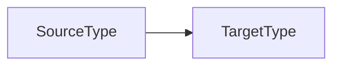

类型转换本质上来说是这么一个过程：



Spring提供了一套基于`Converter`接口的*SPI(Server Provide Interface)*机制。

通过实现`Converter`接口，我们可以根据自己的业务需求制定特定的类型转换规则。

# 1 `Converter`接口

`org.springframework.core.convert.converter.Converter`：

```java
public interface Converter<S, T> {

   @Nullable
   T convert(S source);

   default <U> Converter<S, U> andThen(Converter<? super T, ? extends U> after) {
      Assert.notNull(after, "After Converter must not be null");
      return (S s) -> {
         T initialResult = convert(s);
         return (initialResult != null ? after.convert(initialResult) : null);
      };
   }
}
```

泛型解释：

- `S`：原始类型。
- `T`：目标类型。

方法解释：

- `convert()`：将数据由`S`类型转换到`T`类型。
- `andThen()`：链式类型转换，`S` → `T` → `U`。

例如，我们想要实现一个`Object` → `String`的类型转换，可以按以下步骤进行：

1. 实现`Converter`接口，指定泛型`S`为`Object`，泛型`T`为`String`；
2. 实现`convert()`方法，编写转换规则。

```java
public class ObjectToStringConverter implements Converter<Object, String> {
    @Override
    public String convert(Object source) {
        return source.toString();
    }
}
```

在Spring中则可以通过以下方式调用：

1. 创建`ObjectToStringConverter`，交由容器管理：

```java
@Configuration
public class AppConfig {
    @Bean
    public Converter converter() {
        return new ObjectToStringConverter();
    }
}
```

2. 在业务中注入`Converter`实例：

```java
@Service
public class AppService {
    @Resource
    private Converter converter;

    public void service() {
        Date source = new Date();
        Object target = converter.convert(source);
        System.out.println(target.getClass());
        System.out.println(target);
    }
}
```

3. 外界调用`service()`方法后，会输出以下内容，说明`Date`成功转换成`String`：

```
class java.lang.String
Thu Jan 13 21:33:49 CST 2022
```

Spring的类型转换机制本质上就是这么一个套路。通过实现`Converter`接口，可以针对性的实现不同的类型转换规则，适用于不同的业务场景。

当然，Spring也实现了许多常用的`XxxConverter`，需要进行类型转换时，可以先看看`Converter`的继承层次，是否可以直接使用。

# 2 `ConverterFactory`接口

为了便于管理一系列具有层次关系的`Converter`，Spring还提供了`ConverterFactory`接口。

`org.springframework.core.convert.converter.ConverterFactory`：

```java
public interface ConverterFactory<S, R> {
   <T extends R> Converter<S, T> getConverter(Class<T> targetType);
}
```

泛型解释：

- `S`：原始类型。
- `R`：目标类型的顶层父类/接口。
- `T`：特定目标类型，是`R`的子类/实现类。

方法解释：

- `getConverter()`：获取目标类型为`T`的`Converter`实现类。

例如，如果有以下业务需求：

1. `Charater` → `Integer`
2. `Charater` → `Float`
3. `Charater` → `Long`
4. ……

目标类型都是`Number`的子类，我们可以实现如下`ConverterFactory`：

```java
public class CharacterToNumberFactory implements ConverterFactory<Character, Number> {

   @Override
   public <T extends Number> Converter<Character, T> getConverter(Class<T> targetType) {
      return new CharacterToNumber<>(targetType);
   }

   private static final class CharacterToNumber<T extends Number> implements Converter<Character, T> {

      private final Class<T> targetType;

      public CharacterToNumber(Class<T> targetType) {
         this.targetType = targetType;
      }

      @Override
      public T convert(Character source) {
         return NumberUtils.convertNumberToTargetClass((short) source.charValue(), this.targetType);
      }
   }

}
```

在Spring中则可以通过以下方式调用：

1. 创建`CharacterToNumberFactory`，交由容器管理：

```java
@Configuration
public class AppConfig {
    @Bean
    public ConverterFactory<Character, Number> converter() {
        return new CharacterToNumberFactory();
    }
}
```

2. 在业务中注入`ConverterFactory`实例：

```java
@Service
public class AppService {
    @Resource
    private ConverterFactory converterFactory;

    public void service() {
        Character character = new Character('a');
        Converter integerConverter = converterFactory.getConverter(Integer.class);
        Object target = integerConverter.convert(character);
        System.out.println(target.getClass());
        System.out.println(target);
        Converter doubleConverter = converterFactory.getConverter(Double.class);
        target = doubleConverter.convert(character);
        System.out.println(target.getClass());
        System.out.println(target);
    }
}
```

3. 外界调用`service()`方法后，会输出以下内容，说明`Date`成功转换成`String`：

```
class java.lang.Integer
97
class java.lang.Double
97.0
```

所以说，本质上`ConverterFactory`相当于是管理一系列具有特殊层次关系的`Converter`的工厂，相当于是`Converter`的升级版本。

在需要将同一个`S`类型转换成多个具有层次关系的`T`时，可以优先考虑实现`ConverterFactory`。

# 3 `GenericConverter`接口

`org.springframework.core.convert.converter.GenericConverter`接口以`ConvertiblePair`的形式指定`sourceType`和`targetType`：

```java
public interface GenericConverter {

   Set<ConvertiblePair> getConvertibleTypes();

   Object convert(@Nullable Object source, TypeDescriptor sourceType, TypeDescriptor targetType);

   final class ConvertiblePair {
      private final Class<?> sourceType;
      private final Class<?> targetType;
   }
}
```

`GenericConverter`不会在实现类中固定`sourceType`和`targetType`的数量和类型，相比于`Converter`接口有了更大的灵活度，但也更加复杂。

`convert()`方法中，需要根据`sourceType`和`targetType`的类型进行判断，执行对应的转换逻辑。

`TypeDescriptor`用来描述`sourceType`和`targetType`的类型信息：

```java
public class TypeDescriptor implements Serializable {
    private final Class<?> type;
    private final ResolvableType resolvableType;
    private final TypeDescriptor.AnnotatedElementAdapter annotatedElement;
}
```

举个例子，如果我们需要实现`String` → `DataSize`的类型转换，可以按以下例子进行：

```java
final class StringToDataSizeConverter implements GenericConverter {
    StringToDataSizeConverter() {
    }

    public Set<ConvertiblePair> getConvertibleTypes() {
        return Collections.singleton(new ConvertiblePair(String.class, DataSize.class));
    }

    public Object convert(Object source, TypeDescriptor sourceType, TypeDescriptor targetType) {
        return ObjectUtils.isEmpty(source) ? null : this.convert(source.toString(), this.getDataUnit(targetType));
    }

    private DataUnit getDataUnit(TypeDescriptor targetType) {
        DataSizeUnit annotation = (DataSizeUnit)targetType.getAnnotation(DataSizeUnit.class);
        return annotation != null ? annotation.value() : null;
    }

    private DataSize convert(String source, DataUnit unit) {
        return DataSize.parse(source, unit);
    }
}
```

# 4 `ConditionalConverter`接口

`org.springframework.core.convert.converter.ConditionalConverter`接口提供了`matches()`方法，用来判断当前`Converter`/`GenericConverter`/`ConverterFactory`能否完成从`sourceType`到`targetType`的转换。

```java
public interface ConditionalConverter {
   boolean matches(TypeDescriptor sourceType, TypeDescriptor targetType);
}
```

由于`ConditionalConverter`接口只提供了一个预校验的方法，它更像是一个辅助性功能接口。

它更多的跟其他实际业务接口配合使用，比如上述的`Converter`/`ConverterFactory`/`GenericConverter`等。

# 5 `ConditionalGenericConverter`接口

`org.springframework.core.convert.converter.ConditionalGenericConverter`接口将`ConditionConverter`和`GenericConverter`的功能整合了起来。

我们实现`ConditionalGenericConverter`接口就可以实现上述两个接口的功能。

```java
public interface ConditionalGenericConverter 
    extends GenericConverter, ConditionalConverter {
}
```

